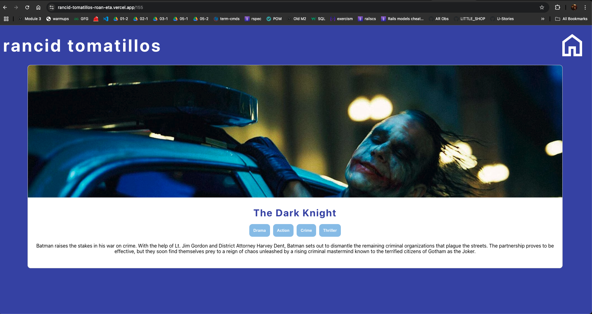
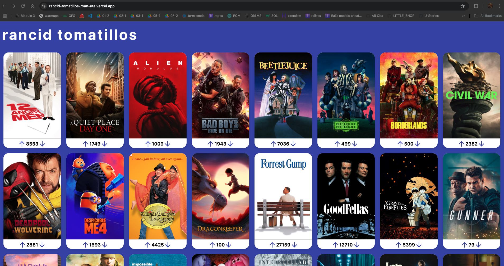

# Rancid Tomatillos 🎥🍅

[Live Demo on Vercel](https://rancid-tomatillos.vercel.app/)

**Rancid Tomatillos** is a movie browsing application built with React. It allows users to explore a collection of movies, search by title, view detailed movie information, and interact by upvoting or downvoting movies.

---

## Features

- 🎬 **Movie Browsing**: Browse a collection of movies with poster images and vote counts.
- 🔍 **Search Functionality**: Search for movies by title using a dynamic search bar.
- 📄 **Movie Details**: View detailed information about a movie, including its title, genres, overview, and backdrop image.
- 👍 **Vote on Movies**: Upvote or downvote movies to indicate your preferences.
- 🔗 **Responsive Navigation**: Navigate between the movie list and individual movie details seamlessly.

---

## Technologies Used

- **React**: For building the user interface.
- **React Router**: For dynamic routing and navigation.
- **CSS**: For styling the application.
- **Fetch API**: For interacting with the backend API.
- **Heroku**: Hosted backend API for fetching movie data.
- **Vercel**: Deployment platform for the React frontend.

---


## Screenshots:





### 2. Install Dependencies
```bash
npm install
```

### 3. Run the App Locally
```bash
npm start
```

The application will run on `http://localhost:3000`.

---

## API Integration

### Base URL
The application consumes the following API:  
`https://rancid-tomatillos-api-cc6f59111a05.herokuapp.com/api/v1/movies`

### Endpoints
1. **Fetch All Movies**:  
   `GET /movies`  
   Retrieves a list of all movies.
   
2. **Fetch Movie Details**:  
   `GET /movies/:movieId`  
   Retrieves detailed information about a specific movie.

3. **Vote on a Movie**:  
   `PATCH /movies/:movieId`  
   Updates the vote count for a specific movie.  
   - Request body example: `{ "vote_direction": "up" }`

---

## App Structure

### Components
1. **App**: The root component handling state and routing.
2. **MoviesContainer**: Displays a list of movie posters.
3. **MoviePoster**: Represents an individual movie poster with voting functionality.
4. **MovieDetails**: Shows detailed information about a specific movie.

---

## Usage

1. **Browse Movies**: 
   - Visit the homepage to view a collection of movies with their posters and vote counts.

2. **Search for a Movie**:
   - Use the search bar at the top to filter movies by title.

3. **View Movie Details**:
   - Click on a movie poster to view its details, including the title, genres, and description.

4. **Vote on Movies**:
   - Upvote or downvote a movie directly from its poster.

---

## Future Improvements

- 🌟 **User Authentication**: Allow users to log in and save their favorite movies.
- 🌟 **Pagination**: Add pagination or infinite scrolling for larger movie collections.
- 🌟 **Enhanced Styling**: Improve the UI with animations and a mobile-friendly design.

---

## Deployment

The backend API is hosted on Heroku, and the React frontend is deployed on Vercel.  
Visit the live app here: [Rancid Tomatillos on Vercel](https://rancid-tomatillos.vercel.app/)

---

## Collaborators

- **Melchor De La Rosa** - [GitHub Profile](https://github.com/MDelarosa1993)
- **Lito Croy** - [Github Profile](https://github.com/litobot)

---

## License

This project is licensed under the MIT License.